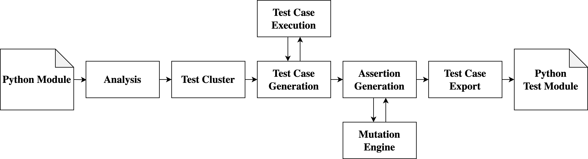

.. _test_generation_overview:

Test Generation Overview
========================

This document provides a high-level overview of how Pynguin's test generation works. It covers the key components and processes involved in generating test cases for Python modules.

Genetic Algorithms for Test Generation
--------------------------------------
To get an conceptual overview of Genetic Algorithms and Search Based Software Testing take a look at the `SBSE 2024 repository`_. In particular, the following Jupyter notebooks on search-based test generation might be of interest:

* `Search-Based Test Generation - Part 1`_: Introduction to search-based test generation
* `Search-Based Test Generation - Part 2`_: Advanced topics in search-based test generation

Pynguin's Test Generation Process
---------------------------------

Python Module
~~~~~~~~~~~~~

Pynguin takes as input a Python module. Usually, a module in Python is equivalent to a source file.

Analysis
~~~~~~~~

Pynguin then analyzes the module to extract information. The extracted information consists, among others, of the declared classes, functions, and methods. From this information, Pynguin builds the so-called test cluster.

Furthermore, Pynguin inspects the modules that are transitively included by the module under test.

From the context, Pynguin extracts the types they define by searching for those class definitions that are available in the namespace of the module under test. These types are then used as input-type candidates during the test-generation phase.

The entry point for this analysis is the :func:`pynguin.analyses.module.analyse_module`.

The :class:`pynguin.analyses.typesystem.TypeSystem` and the :class:`pynguin.analyses.typesystem.InferredSignature` classes handles the inference of parameter and return types based on the analysis and other information gained during Pynguin execution.

Test Cluster
~~~~~~~~~~~~

The test cluster contains all information about the module under test, most importantly, which classes, functions, and methods are declared, and what their parameters are.

The :class:`pynguin.analyses.module.ModuleTestCluster` class maintains a collection of accessible objects under test.

Test Case Construction
~~~~~~~~~~~~~~~~~~~~~~

When constructing a test case, Pynguin selects a function or method from the module under test.

Afterwards, Pynguin aims to fulfill the requirements of the function's parameters in a backwards fashion. If the function requires integer parameters (based on type annotations), Pynguin generates one to three variable assignment statements of the form ``var = <num>`` and adds them to the test case before the function-call statement. The number of integer statements as well as the generated values are chosen randomly by Pynguin, because variable values can be used for more than one parameter.

In case a more complex object is required as a parameter, Pynguin will attempt to generate it by recursively fulfilling the parameters of the involved methods; the necessary statements are also prepended to the list of statements of the test case.

Pynguin then uses an genetic algorithm, such as for example the DynaMOSA algorithm, to mutate, select and do crossover.

The :class:`pynguin.testcase.testcase.TestCase` class provides the abstract base for test cases, with :class:`pynguin.testcase.defaulttestcase.DefaultTestCase` being the concrete implementation. The :class:`pynguin.ga.testcasefactory.TestCaseFactory` and its subclasses are responsible for creating new test cases during the search process.

Test Case Execution
~~~~~~~~~~~~~~~~~~~

Pynguin then executes the newly generated test cases against the module under test to measure the achieved coverage by instrumenting Python's byte code on-the-fly to trace which parts of the module under test have been executed by a generated test.

It then continues with the next iteration of the test-generation algorithm. This process stops once a configurable stopping condition is satisfied.

The :class:`pynguin.testcase.execution.TestCaseExecutor` class is responsible for executing test cases. The :class:`pynguin.instrumentation.tracer.ExecutionTracer` handles the instrumentation and tracing of code execution during test runs.

**Ignoring Code**: The :attr:`pynguin.configuration.Configuration.ignore_methods` and :attr:`pynguin.configuration.Configuration.ignore_modules` options create a blacklist that prevents analysis and inclusion in the test cluster.
This is useful for code that should not be executed, but not suitable for code that should be omitted as a coverage goal.

**Fitness Function**: The :class:`pynguin.ga.computations.FitnessFunction` class is responsible for evaluating the fitness of generated test cases:

- The :class:`pynguin.instrumentation.tracer.ExecutionTracer` instruments conditional jumps
- For equality comparisons, Levenshtein distance is used
- For Strings comparison character distance based on left-aligned strings is used

Assertion Generation
~~~~~~~~~~~~~~~~~~~~

After the test case generation, Pynguin optionally attempts to generate regression assertions to not only execute the code under test but also check its results. The approach implemented in Pynguin is based on mutation testing.

Mutation Engine
~~~~~~~~~~~~~~~

The generated tests are executed against generated mutants as well as the original module. By tracing the values of object attributes and function returns, Pynguin determines which values change on the mutated version, compared to the original module. For these values, Pynguin generates assertions that interpret the returned values on the original module as the ground truth.

Important classes for Mutation are:

- :class:`pynguin.assertion.assertiongenerator.MutationAnalysisAssertionGenerator` which coordinates the mutation process
- :class:`pynguin.assertion.mutation_analysis.controller.MutationController` that creates mutants
- :class:`pynguin.assertion.mutation_analysis.mutators.FirstOrderMutator` that applies mutations to the code

Further Implementation Details
------------------------------

In the following you can find an incomplete list of more specific implementation details.

Dynamic Seeding
~~~~~~~~~~~~~~~

Dynamic seeding helps Pynguin generate effective test inputs by collecting values from the code under test.

**Instrumentation**: The :class:`pynguin.instrumentation.version.DynamicSeedingInstrumentation` class:

- Instruments comparison operations
- Adds values from both sides of equality comparisons
- Handles string operations like ``.endswith()`` and ``.startswith()``

Type Tracing
~~~~~~~~~~~~

Pynguin requires a second test execution, but allows for refining parameter types:

- First execution: For regular results
- Second execution: With proxies to refine parameter types
- The :class:`pynguin.testcase.execution.TypeTracingObserver` monitors execution to collect type information
- It creates :class:`pynguin.utils.typetracing.UsageTraceNode` objects to store the traced type information (based on type checks, argument types and child nodes in the execution tree)
- :meth:`pynguin.analyses.typesystem.InferredSignature.get_parameter_types` methods update guesses based on usage traces

.. _SBSE 2024 repository: https://github.com/se2p/sbse2024
.. _Search-Based Test Generation - Part 1: https://github.com/se2p/sbse2024/blob/main/Search-Based%20Test%20Generation%20-%20Part%201.ipynb
.. _Search-Based Test Generation - Part 2: https://github.com/se2p/sbse2024/blob/main/Search-Based%20Test%20Generation%20-%20Part%202.ipynb

Master-Worker Architecture
~~~~~~~~~~~~~~~~~~~~~~~~~~
The master-worker architecture provides fault-recovering execution model
for Pynguin's test generation process. It isolates the core test generation logic
into a separate worker process, which is managed and monitored by a master process.
This prevents the main Pynguin application from crashing if the test generation
process fails unexpectedly (e.g., due to a segmentation fault during threaded
execution) and allows for automatic restart (no recovery) of test generation.

Components
^^^^^^^^^^

**PynguinClient**

This is the main public interface. It simplifies the interaction with the
master-worker system. The client is responsible for starting and stopping the
``MasterProcess`` and submitting the initial test generation task.

**MasterProcess**

This is the central coordinator. It manages worker processes as ``RunningTask`` instances.

**RunningTask**

A ``RunningTask`` represents a test generation task in its own worker process.
It is responsible for:

- Restarting the worker process if it crashes.
- Automatically adjusting the configuration (e.g., remaining search time) after a worker crash.
- Enabling the more robust subprocess execution mode within the worker if a crash occurs.

**worker_main**

This function runs in a separate, dedicated process. It executes ``run_pynguin``
with the provided configuration and returns the results back to the master.

Workflow
^^^^^^^^

1. A ``PynguinClient`` is created, which in turn initializes a ``MasterProcess``.
2. The client starts the master with a given configuration for test generation.
3. The ``MasterProcess`` starts a ``WorkerTask`` as subprocess and stores a
   ``RunningTask`` for the provided configuration.
4. The worker executes the ``WorkerTask``.
5. If the worker crashes, the ``RunningTask`` starts a new ``WorkerTask`` with an
   adjusted configuration (reduced search time, subprocess execution).
6. Upon completion, the worker sends a ``WorkerResult`` back to the ``RunningTask``,
   which returns it to the ``MasterProcess``.
7. The client retrieves this result from the master and returns the ``ReturnCode``
   of the Pynguin execution.
