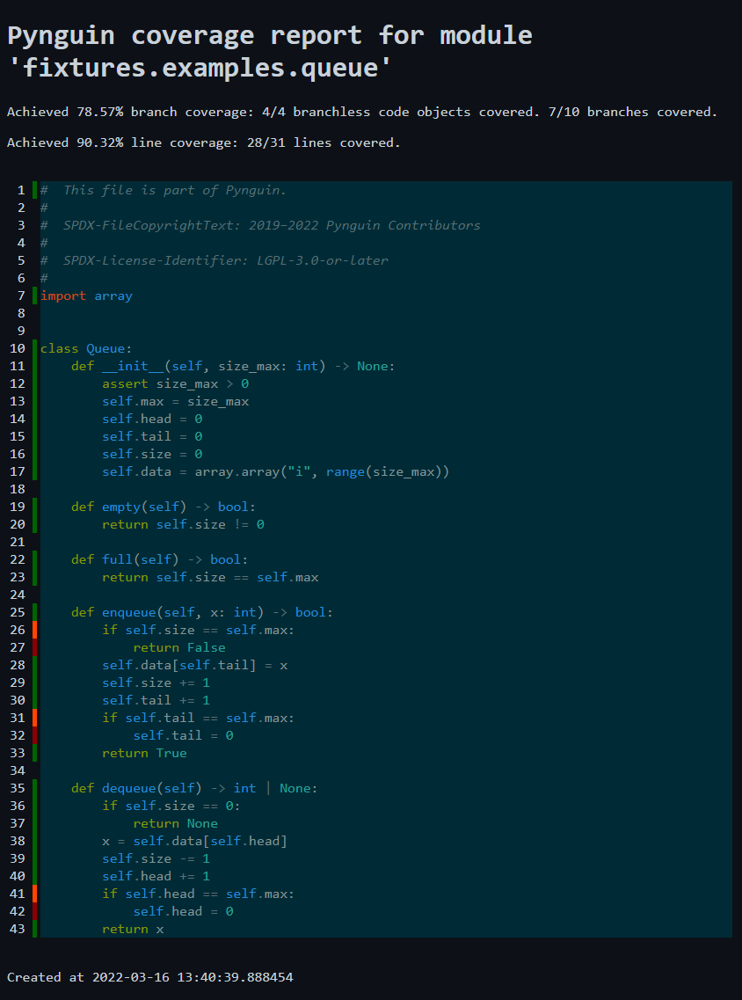
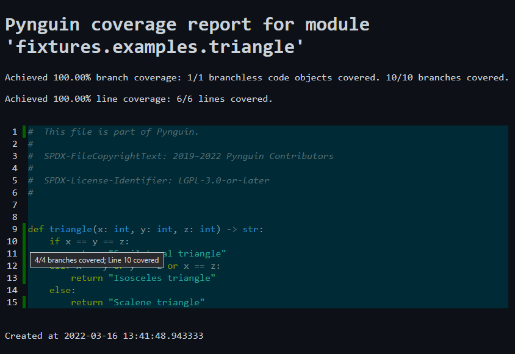

.. _coverage:

Coverage measurement
====================

Pynguin uses bytecode instrumentation to measure code coverage.
For this, Pynguin modifies the bytecode of the module under test
after it was compiled to bytecode but before it is executed.

Pynguin currently has support for branch and line coverage, which can be selected using
``--coverage-metrics``, for example, one can use ``--coverage-metrics BRANCH LINE`` to target both metrics.

`Coverage.py <https://coverage.readthedocs.io/en/stable/>`_ is the standard tool for
measuring line and branch coverage in Python. Its measurements are based on
executed lines (line coverage) and the transitions between them (branch coverage).
Since Pynguin measures coverage at the bytecode level, there are some difference between
its measured values and those of Coverage.py. In order to make it easier to see what parts have been (partially)
covered by Pynguin, one can set the option ``--create-coverage-report True`` to generate
a coverage report similar to the one of Coverage.py. The report is created at the
location specified by ``--report-dir`` (``./pynguin-report/`` by default).

A report for the :ref:`quickstart <quickstart>` ``Queue`` example might look like this:

Where the marker colours have the following meaning:

* Green: Everything located at that line has been covered
* Orange: Not all branches located at that line have been covered, for example, line 26 did not jump to line 27.
* Red: Nothing at that line has been covered.

Hovering over the line number of a coloured line displays a tooltip with detailed information,
which can be seen in the following example:

Pynguin measures branch coverage on the basis of `code objects <https://docs.python.org/3/library/inspect.html>`_ and
their bytecode instructions. If the instructions of a code object contain no conditional jump,
then Pynguin will count it as a *branchless code object*, which is seen as covered if it was executed at least once.
For actual branches, Pynguin requires that each conditional jump is taken and not taken at least once.

Markers for branchless code objects are placed at the first line that belongs to the respective code object.
A module itself is also a code object that is executed on import, for example, the module containing the ``triangle`` function
is a branchless code object and thus has a green marker at line 1.

.. note::
  Code objects are nested within each other, that means that the code object of the module contains the code objects of the functions defined
  directly within it in its constant table an so on.

For branches, the markers are placed at the line where the branching occurs, for example,
the ``triangle`` function has four branches on line 10, due to a compound predicate (``x == y and y == z``) and short circuiting
within the bytecode. Note that this is different to Coverage.py, which would only assign two branches to this line, that is,
either a jump to line 11 or 12. Furthermore, Coverage.py recognizes only branches that cause a line transition, for example,
the expression ``assert size_max > 0`` contains a branch at the bytecode level, as it is equivalent to the following source code:

.. code-block:: python

  if size_max <= 0:
     raise AssertionError()

Such a branch which jumps within the same line is recognized by Pynguin but not by Coverage.py.

For line coverage the markers are placed at the respective lines.
However, only lines that actually contain something that is compiled to bytecode instructions are seen as relevant,
for example, the ``else:`` label in line 14 does not contain anything executable and is thus ignored.
